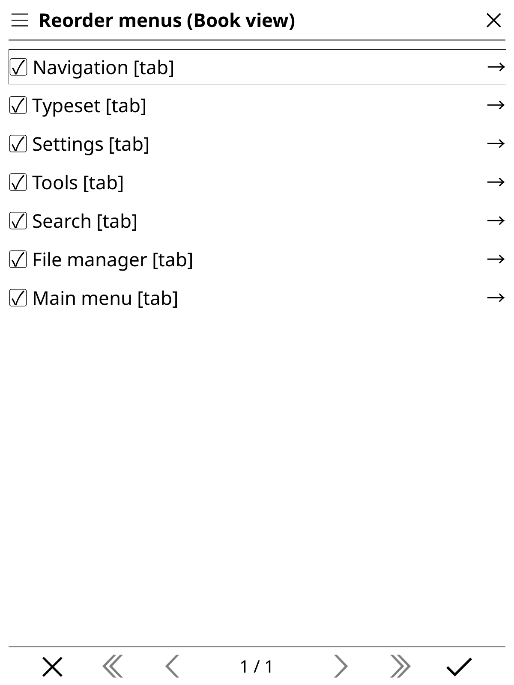
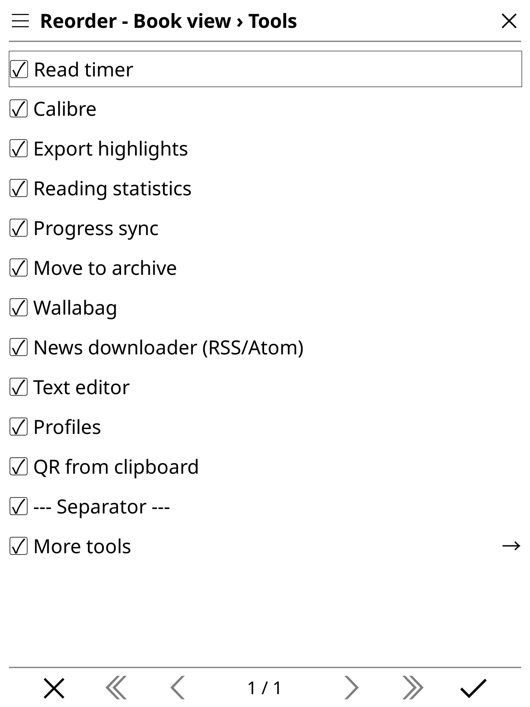
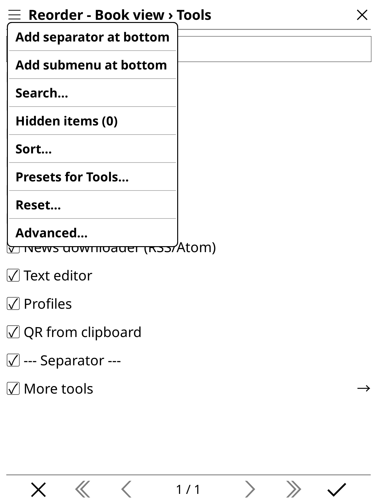

# Reordering Menus for KOReader

Reorder, hide, move, and group KOReader menu items in both **Book view** and the **File Manager**, using KOReader's native interface.

<p align="center">
  
  
</p>

<p align="center">
  
  
</p>

## Features

- Customize Book view and File Manager independently, including nested submenus.
- Reorder and hide items, move items or submenus to valid destinations, and
  create custom submenus. Top-level tabs can be reordered or hidden.
- Save view layouts or direct/nested submenu presets.
- Reset an item, submenu, one view, or both views to stock defaults.
- Optionally mirror visibility changes and cross-menu moves between views
  when the item and destination exist in both. Other changes remain per-view.
- Let untouched items follow KOReader and plugin updates automatically.

## Installation

1. Download the latest `reorderingmenus-v<version>.zip` from the [Releases](https://github.com/nraikm/ReorderingMenus/releases) page.
2. Unpack the zip file.
3. Copy the `reorderingmenus.koplugin` folder into your KOReader `plugins/` directory (e.g. `koreader/plugins/reorderingmenus.koplugin`).
4. Restart KOReader.

## Editing menus

Open **Tools → More tools → Reorder menus**.

1. Drag entries to reorder them; tap a checkbox to hide or show an entry.
2. Open a submenu with the arrow at the row's trailing edge. You can also tap
   an already-selected submenu or hold it and choose **Edit submenu contents**.
   Nested editor titles show the path, such as `Book view › Tools › More tools`.
3. Use the top-left hamburger menu for search, hidden items, sorting, presets,
   custom submenus, resets, and advanced options.
4. Tap the bottom-right checkmark to save. The title marks unsaved changes;
   closing a changed editor offers **Save / Discard / Cancel**.

## Presets

**View presets** save the current Book view or File Manager layout. Open
**Presets…** in the top-level editor to save a named layout or apply a built-in
preset. View presets include explicit placement and visibility choices.

**Submenu presets** are available under **Presets for _menu name_…**:

- **Save this menu order…** (`[Direct]`) captures the immediate item sequence.
- **Save with nested submenu orders…** (`[Nested]`) also captures descendant orders.

Applying a submenu preset changes sequences while retaining existing visibility
settings and custom-created submenus.

## Disabling or uninstalling

**Disabling** Reordering Menus (via the plugin manager) automatically
returns Book view and File Manager menus to stock KOReader order on the
next menu build. Your custom layout is kept safely aside, so
**re-enabling** restores it exactly as it was.

**Uninstalling** (deleting the plugin folder) runs no plugin code, so use
the removal preparation tool first if you hid any top-level menus or tabs:

```text
Tools → More tools → Reorder menus → Hamburger → Advanced… → Prepare for plugin removal…
```

This unhides all items across both views, ensuring that stock KOReader and other third-party plugins can find their default menu destinations without issue when Reordering Menus is no longer active.

## Compatibility

- The automated integration baseline is KOReader
  `v2025.10-43-g562fc11_2025-11-28`. Other releases may work, but are not
  claimed supported until they pass the same suite. Private integration
  points are capability-gated where KOReader exposes a reliable probe; see
  the compatibility matrix before widening this window.
- Works entirely within user settings (`settings/reader_menu_order.lua`, `settings/filemanager_menu_order.lua`, `settings/reorderingmenus_intent.lua`) without patching core KOReader application files.

## Development

- [Architecture](docs/architecture.md): data flow, modules, state, and invariants.
- [Compatibility](docs/compatibility-matrix.md): integration boundaries and workaround removal.
- [Migration policy](docs/migration-policy.md): file versions and recovery rules.
- [Testing](docs/testing.md): suites, seed replay, fixtures, and release verification.

### Running Tests

Run the quick suite with the LuaJIT bundled with your KOReader installation:

```bash
./run_tests.sh
```

See the [Testing Guide](docs/testing.md) for targeted suites, scaled tiers,
seed replay, fixture handling, and release verification.
